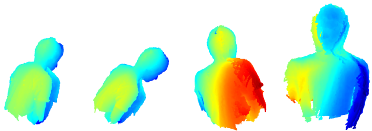
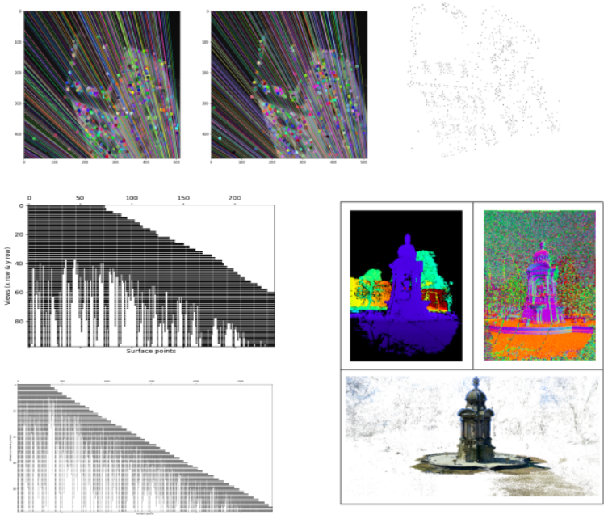
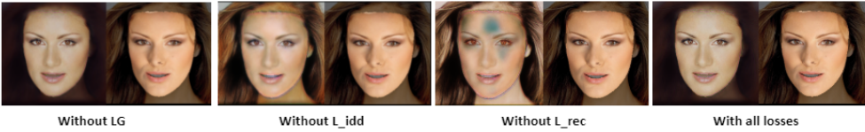

# Computer-Vision-2
This repository contains lab assignments for the 2021-2022 computer vision 1 course at University of Amsterdam.

## Assignment 1: Iterative Closest points

In this assignment, we perform a wide analysis of the ICP algorithm and some of its variants. 
Iterative closest point (ICP) is an algorithm employed to minimize the difference between
two clouds of points (RMS value), by consecutive calculations of the Rotation (R) and translation (t)
matrices. As a second direction in this assignment we implement different techniques that have been
proposed in order to improve the original ICP algorithm in terms of i) accuracy, ii) speed, iii) stability
and iv) tolerance to noise. In section 3, we transfer our evaluation from the synthetic (idealized)
data to the real-world data, which are mostly noisy and contain artefacts. The object of this part is
the reconstruction of the 3D representation of a man from 2D frames by examining two cases, the
merging of all pose estimations at the end and the merging every N frames.

## Assignment 2: Structure from Motion

In this assignment, we first calculate the fundamental matrix using three different methods, and then we compare these methods. The
matching process in this first step is performed across pairs of views. Consequently, we implement the point-view matrix to represent
point correspondences for different camera views and visualize them into a single match graph structure. In the following step, we use
the previous point-view matrix to recover a 3D structure from 2D images. We then investigate other methods that could potentially
improve the results. Finally, we use COLMAP an industrial tool that works with real-world data. Using this tool we perform various
experiments and observe how the changes we did, affect the results.

## Assignment 3: 2D-to-3D for FaceSwapping

In this assignment, we implement our face swapping pipeline with the help of 2D-to-3D reconstruction. The task of face reenactment is to change the attribute of a face image (i.e. pose, expression or light), while face swapping is focused on changing face identity of an image while keeping other attributes (pose, expression and background) the same
